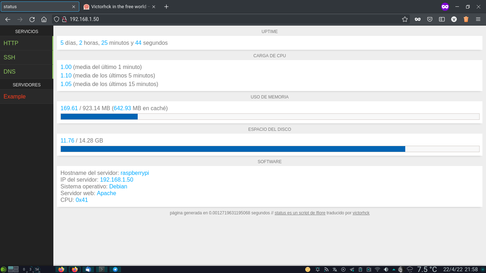

status
======

Un script en PHP que monitoriza el _uptime_, carga de CPU, RAM y uso de disco de tu servidor.

También monitoriza servicios que se ejecutan en el servidor y si otros servidores están online u offline.

Puedes configurar qué servicios/servidores monitorizar editando el archivo conf.php. 

La información se actualizará cada 5 segundos mediante un script en AJAX.

Script creado por lfiore disponible en [GitHub](https://github.com/lfiore/status) publicado bajo licencia MIT. Este _fork_ únicamente traduce algunas cadenas y poco más.
